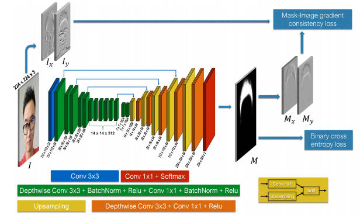
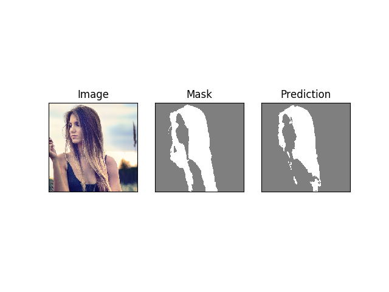

# mobile-hair-segmentation-pytorch
This repository is part of a program for previewing your own dyeing on mobile device.
To do this, you need to separate the hair from the head.
And we have to use as light model as MobileNet to use in mobile device in real time.
So we borrowed the model structure from the following article.  
  
[Real-time deep hair matting on mobile devices](https://arxiv.org/abs/1712.07168) 

## model architecture
   
This model MobileNet + SegNet.  
To do semantic segmentation they transform MobileNet like SegNet.
And add additional loss function to capture fine hair texture.

## install requirements
```bash
pip install -r requirements.txt
```

## preparing datsets
make directory like this
```
dataset
   |__ images
   |
   |__ masks
   
```
expected image name  
The name of the expected image pair is:  
```
 - dataset/images/1.jpg 
| 
 - dataset/masks/1.jpg  
```

```
/dataset
    /images
        /1.jpg
        /2.jpg
        /3.jpg 
         ...
    /masks
        /1.jpg
        /2.jpg
        /3.jpg 
         ...
```
## how to train
after 200 epoch, add other commented augmentation and remove resize  
(dataloader/dataloader.py)  
run main
```
python main.py
```
if you want do transfer learning with model made of MobileNet V2 network
```
python main.py --transfer_learning=True
```
``` python
from src.train import Trainer
from data.dataloader import get_loader
from config.config import get_config

config = get_config()
data_loader = get_loader(config.data_path, config.batch_size, config.image_size,
                        shuffle=True, num_workers=int(config.workers))
trainer = Trainer(config, data_loader)
```
## Test
```bash
python webcam.py
```

## Overall result
it use argmax function to get mask  



